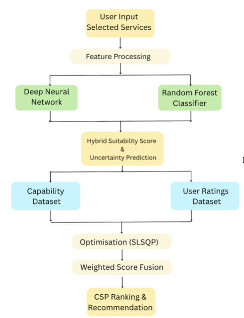
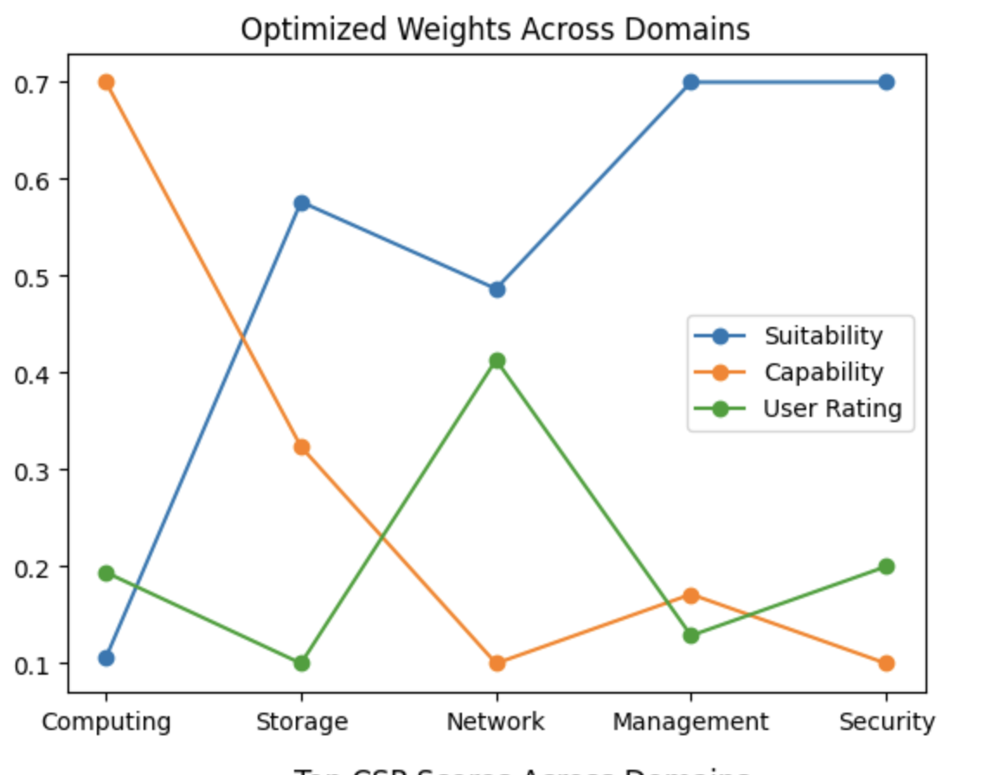
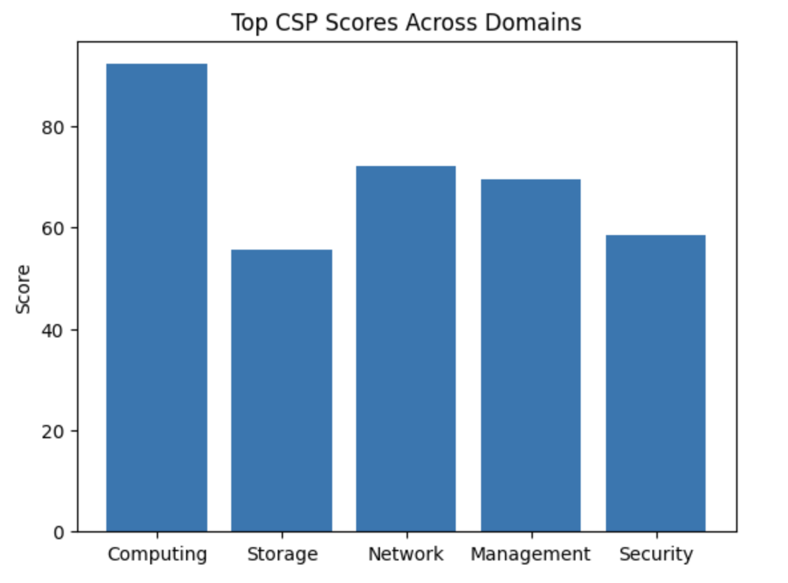
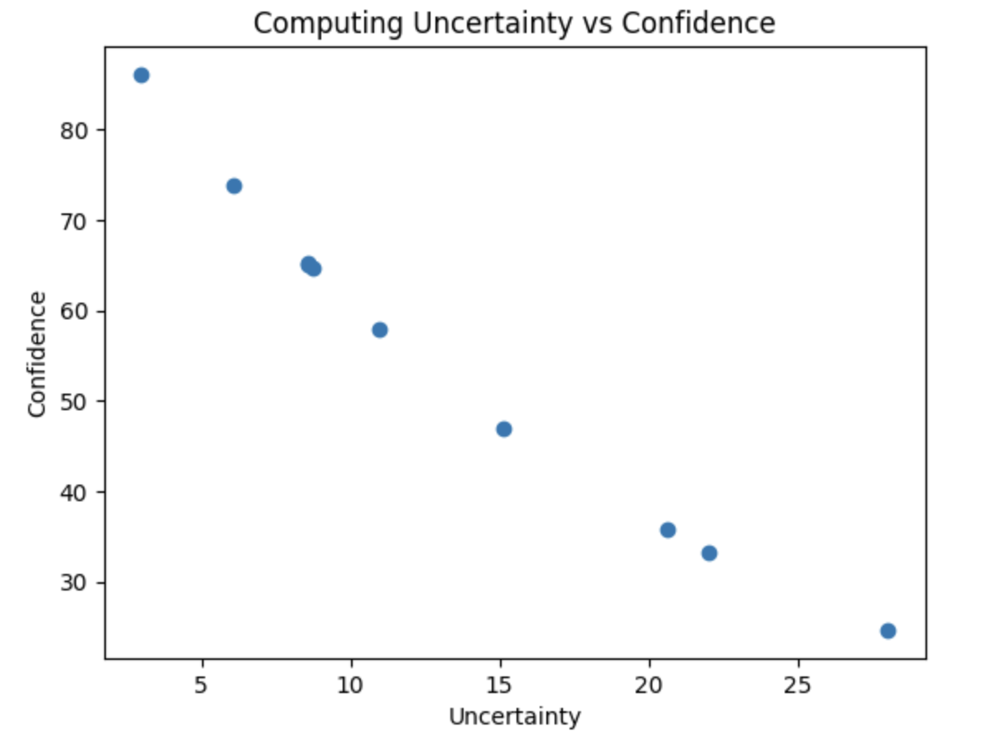

# Cloud-Service-Recommender

An uncertainty-aware hybrid recommendation framework for selecting Cloud Service Providers (CSPs) across multiple service domains using Deep Learning, Machine Learning, uncertainty estimation, and adaptive optimization.

Overview

Choosing an appropriate Cloud Service Provider can be challenging due to the large number of providers and the wide variety of services they offer. This project presents a hybrid recommendation system that generates personalized CSP recommendations based on user-selected cloud service requirements.

The framework combines Deep Neural Networks (DNN), Random Forests (RF), Monte Carlo Dropout, uncertainty estimation, adaptive weight optimization, and multi-signal score fusion to rank service providers according to suitability, provider capability, and user feedback.

The system supports recommendations across five cloud service domains:

* Computing
* Storage
* Network
* Management
* Security

Features

* Hybrid Deep Neural Network + Random Forest prediction
* Monte Carlo Dropout for uncertainty estimation
* Random Forest ensemble variance analysis
* Adaptive weight optimization using Sequential Least Squares Programming (SLSQP)
* Multi-signal score fusion
* Stability-aware provider evaluation
* Confidence-aware recommendation ranking
* Visualization of optimization weights, recommendation scores, and uncertainty analysis

System Architecture

  

Workflow

1. User selects required cloud service features.
2. Selected features are converted into a binary input vector.
3. The input is processed by:
    * Deep Neural Network (DNN)
    * Random Forest classifier
4. Monte Carlo Dropout and Random Forest ensemble variance estimate prediction uncertainty.
5. Capability scores and user rating scores are computed from separate datasets.
6. SLSQP optimization determines adaptive fusion weights.
7. The final recommendation score is calculated using suitability, capability, user ratings, uncertainty, and stability.
8. Cloud Service Providers are ranked according to the final score.

Technologies Used

* Python
* TensorFlow / Keras
* Scikit-learn
* Pandas
* NumPy
* SciPy
* Matplotlib

Project Structure

Cloud-Service-Recommender/
│
├── csp_recommender.py
├── README.md
├── requirements.txt
├── architecture.png
├── graphs/
│   ├── weights_across_domains.png
│   ├── top_scores.png
│   └── uncertainty_vs_confidence.png
└── LICENSE

⸻

Installation

Clone the repository

git clone https://github.com/<your-username>/Cloud-Service-Recommender.git

Install the required libraries

pip install -r requirements.txt

Run the project

python csp_recommender.py

Results

The framework generates:

* Optimized fusion weights
* Provider rankings
* Confidence scores
* Final recommendation scores
* Visualization of optimization weights
* Top provider comparison
* Uncertainty vs Confidence analysis

Example outputs are available in the graphs folder.

## Results

### Optimized Weights Across Domains

### Top CSP Scores Across Domains

### Uncertainty vs Confidence

Dataset

The datasets used during this research were provided through an academic workshop and are therefore not included in this repository.

The implementation can be adapted to any dataset with the same structure.

Note on Model Accuracy

The Deep Neural Network achieves very high classification accuracy on the provided datasets due to the strong separation between service provider feature sets.

This result reflects the characteristics of the dataset rather than guaranteeing identical performance on unseen real-world cloud service data. The recommendation framework therefore incorporates uncertainty estimation, confidence scoring, and stability analysis to improve recommendation reliability.

Future Improvements

* Real-time cloud provider benchmarking
* Explainable AI (XAI) for recommendation reasoning
* Integration with public cloud provider APIs
* Interactive web interface
* Evaluation on larger real-world datasets

License

This project is released under the MIT License.
